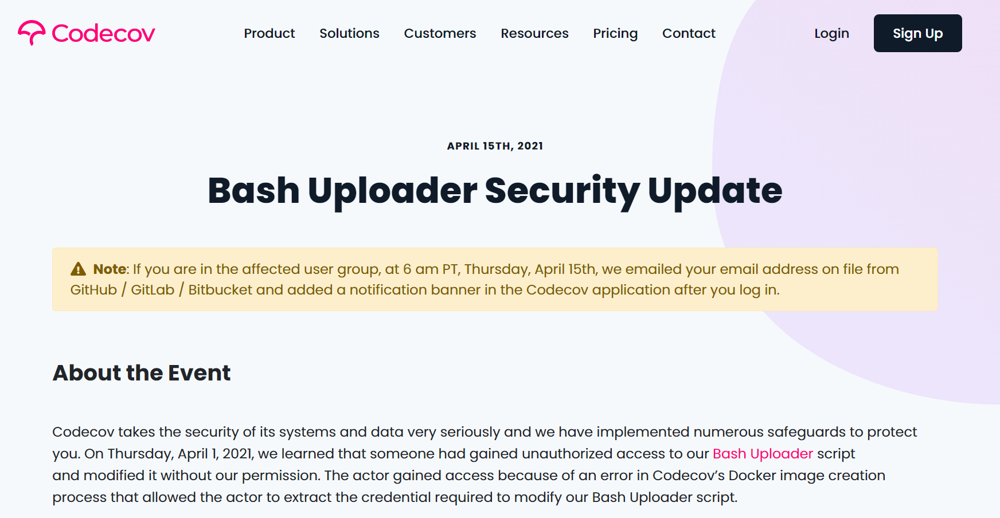

On April 15th we learned that CodeCov, one of the dependencies Dapr uses as part of our build pipeline, was targeted in a compromise of their bash uploader, which is used in their GitHub Action tool. You can read the full notice at https://about.codecov.io/security-update/. CodeCov in turn notified all customers who were believed to have been impacted. **Dapr did not receive a notice, and was not part of CodeCov's list of impacted repos**.

  

For Dapr, security is a fundamental requirement for both designing our software and releasing our builds to our customers. While Dapr did not receive a notification indicating we were part of the breach, in an overabundance of caution we underwent a full credential rotation exercise on all repos utilizing the CodeCov build tool. All passwords, tokens, signing keys, and API keys were rotated as part of this exercise, including all test infrastructure, release pipelines, and package managers.

The Dapr team also verified all binaries, package managers, source code, and container registries were not modified outside of normal Dapr release pipelines. Microsoft security operations was also looped in and reviewed the credential rotation and audit, verifying Dapr was not impacted by the breach in any way and successfully rolled all credentials.

Going forward, Dapr will continue to rotate credentials on a regular basis to ensure the highest level of security in build pipelines and test infrastructure. You can learn more about Dapr security at https://aka.ms/dapr/security.

Lastly, if you use CodeCov in any of your repos we recommend you follow the guidance on the CodeCov website (https://about.codecov.io/security-update/) and rotate all GitHub secrets.