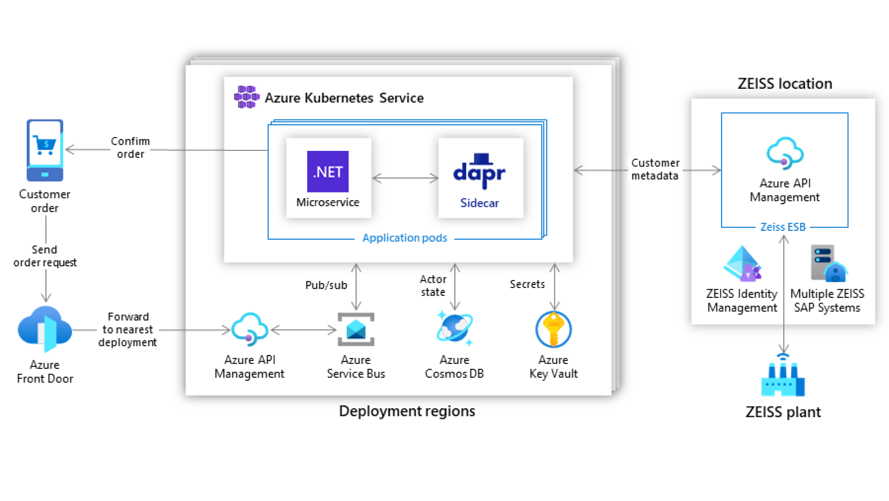
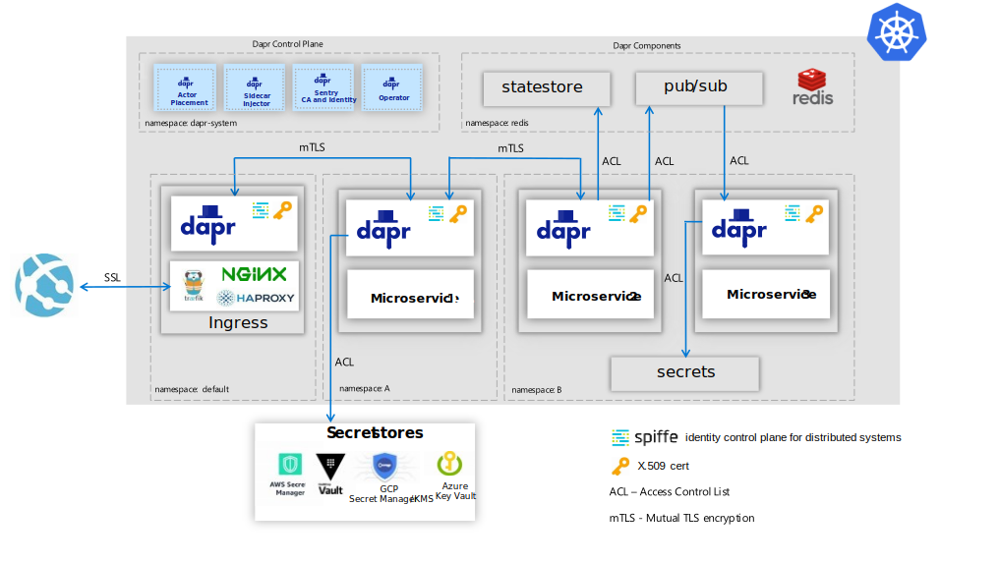
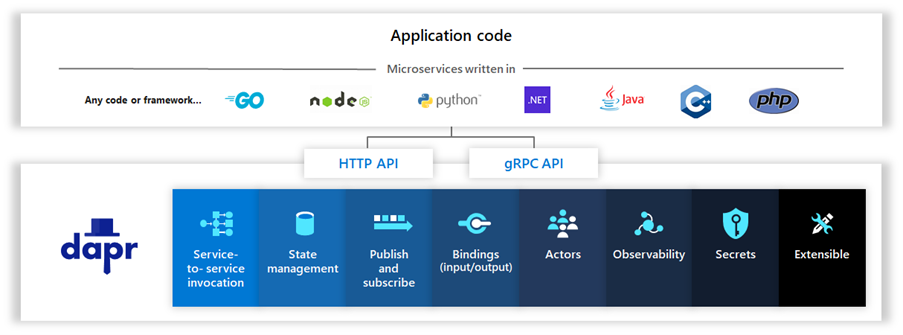

Today we are excited to announce the v1.0 release of the Distributed Application Runtime ([Dapr](https://dapr.io)), which has achieved the stability and enterprise readiness to be designated production ready. Dapr is an open source, portable, event-driven runtime that makes it easy for developers to build resilient, microservice, stateless and stateful applications that run on the cloud and edge. Dapr enables developers to focus on writing business logic and not solving distributed system challenges, thereby significantly improving their productivity, and reducing development time. Dapr lowers the bar for entry to build modern cloud native applications based on a microservices architecture and with this v1.0 release, Dapr applications can be deployed to self-hosted infrastructure or Kubernetes clusters in production scenarios.

Since its [first release in Oct 2019](https://cloudblogs.microsoft.com/opensource/2019/10/16/announcing-dapr-open-source-project-build-microservice-applications/), Dapr has had [14 releases](https://github.com/dapr/dapr/releases), each one building on tremendous community and customer feedback to drive improvements, stability and performance. These releases were grounded in building real applications that reflect what developers are doing today when developing cloud native applications; whether on cloud, edge or private infrastructure, and with the community stepping up to contribute Dapr components that integrate with Azure, AWS, Alibaba and Google clouds.

## Solving distributed application challenges in real world scenarios
From its founding, the Dapr open source project is for developers who are building new real world greenfield applications as well as those migrating and leveraging existing applications and components in cloud-native architectures. Key to Dapr’s approach is to meet developers and enterprises where they are today, helping to modernize their applications, and leverage their existing skills in cloud native and micro-services architecture. In the v1.0 release we have focused on Kubernetes as the primary hosting environment to run production applications, and as Dapr matures further we expect to see Dapr in serverless environments. We’ve worked closely with early adopters and partners over the past one and half years, and as a result Dapr is now at the core of several production and pre-production Kubernetes-based applications. In this customer driven journey, the Dapr community has improved the native language experiences of the Java, .NET and Python SDKs, tested scale and performance with real workloads, added security features, and proven that Dapr’s actor programming model is the best choice for workflow and IoT scenarios. Here are some of the customer stories to highlight how Dapr is being used today. 

### ZEISS, an international technology leader in optics and opto-electronics
The challenge for ZEISS was maintaining and updating a 20-year-old back-end system with hard-coded business rules. The original order validation and routing solution was based on a monolithic architecture with fixed capacities where developers couldn’t easily update, reroute, or track orders without reconfiguring tables directly in the system. In addition, business units had no direct control over their order processing flow. With so many system dependencies, changes always required costly, time-consuming developer intervention. To overcome this, ZEISS developed a new application using Azure and Dapr to fulfill orders faster for customers, while also speeding up development and improving business continuity for the company. You can read more about their story [here](https://customers.microsoft.com/en-us/story/1336089737047375040-zeiss-accelerates-cloud-first-development-on-azure-and-streamlines-order-processing).

### Ignition Group, a South Africa-based technology business focusing on customer engagement and sales-support tools
Ignition Group builds order processing software to track products, manage subscriptions, and handle payments from a variety of sources. Order processing involves many dependencies with a purchase tracking mechanism that invokes a customer subscription, triggers accounting and billing processes, and determines the appropriate payment channel. Ignition Group wanted the benefits that microservices would bring to its workflow logic—high availability, resiliency, scalability, and performance. Using Dapr and .NET Core, Ignition Group built a new, more scalable, maintainable order processing and payment system which is now running in production. Ignition Group are running in production today and you can read more about their story [here](https://customers.microsoft.com/en-us/story/1335733425802443016-ignition-group-speeds-development-and-payment-processing-using-dapr-and-azure).

### Roadwork, data gathering to gain insights
Roadwork is a startup that provides an end-to-end platform for autonomous systems, enabling users to generate actionable insights and act on them. Currently they are focused on data extraction techniques, with a path towards fully integrated autonomous systems. By combing Dapr with [KEDA](https://keda.sh/) they created a production service on Kubernetes that automatically scales both the application and the cluster based on the incoming customer load requests. Dapr provided the abstraction and integration with pub/sub using RabbitMQ and its ability to easily have a [competing consumer pattern](https://docs.dapr.io/developing-applications/building-blocks/pubsub/pubsub-overview/#consumer-groups-and-competing-consumers-pattern). Roadwork’s first product, [Scraper.ai](https://scraper.ai/) is already running in production today. Learn more [here](https://blog.dapr.io/posts/2021/02/09/running-dapr-in-production-at-roadwork/).

## Community and ecosystem
Getting Dapr to the v1.0 has been a community effort. It has been amazing to see the open source community rally around Dapr and grow since it was first announced – growing from a little over 114 contributors in October 2019 to 700 today. A growth of over six-fold in only 16 months!

Community contributions to the project have gone to every Dapr repo and have ranged from opening issues, commenting on feature proposals, providing samples, and of course contributing code. The parts of the project community members have contributed to the most include the Dapr runtime, docs, CLI and SDKs. One additional key area of contribution has been the creation of a rich ecosystem of components. Having over 70 components available to developers makes Dapr a solution for a wide range of scenarios and includes both open source technologies and cloud provider specific integrations. These make Dapr an appealing choice for developers looking to create cloud agnostic applications with high portability.

Contributions have not been limited to individuals, but also included organizations such as Alibaba Cloud, HashiCorp, Microsoft and the early adopters like ZEISS and Ignition Group mentioned above. The Dapr ecosystem also includes partner technology stacks that provide added value to developers who use them with Dapr. For example, New Relic has provided [guidance](https://blog.dapr.io/posts/2021/01/26/observing-dapr-applications-with-new-relic-one/) on how their monitoring tools seamlessly work with Dapr thanks to Dapr’s use of standard tracing protocols that easily instrument your application without any code changes.

Fostering an open and inclusive community is a primary goal for the Dapr project. As part of that commitment, we shared the [transition to an open governance model](https://blog.dapr.io/posts/2020/09/30/transitioning-the-dapr-project-to-open-governance/) which is how we aim to keep Dapr open, vendor neutral and inclusive. Our vision is to continue this journey and intend to have Dapr join an open software foundation in the near future. In the meantime, we invite you to engage with the Dapr community over [GitHub](https://github.com/dapr), the regular Dapr [community calls](https://github.com/dapr/community#community-meetings) and the recently launched [Discord server](https://aka.ms/dapr-discord).

>*"At Alibaba Cloud, we believe Dapr will lead the evolution of microservices. By adopting Dapr, our customers now enjoy increased velocity for building portable and robust distributed systems."*
**-	Xiang Li, Senior Staff Engineer, Alibaba Cloud**

## Release highlights
Over the last few months we have published three v1.0 release candidates to focus on getting feedback from the community and preparing for the v1.0 release. This included a deeper focus on production readiness, in areas such as performance, security, High Availability (HA) and conformance. The full release notes are available [here](https://github.com/dapr/dapr/blob/release-1.0/docs/release_notes/v1.0.0.md), these are some of the highlights:

### Kubernetes as a production environment
For the v1.0 release, Kubernetes is the primary hosting environment, and it is [deeply integrated with both the Dapr control plane and Dapr sidecar architecture](https://docs.dapr.io/operations/hosting/kubernetes/kubernetes-overview/). For example, operationally installing and upgrading Dapr to Kubernetes is simplified with Dapr CLI “init” and “upgrade” commands that pull down the correct Dapr runtime versions and ensure that these are rolled out in a controlled manner, including migrating certificates that are in use. You can install the Dapr control plan in HA mode ensuring that multiple instances are running and the Dapr side car has a health endpoint that enable Kubernetes readiness and liveness probes to determine its health state. Throughout the release candidate process, we have worked closely with early adopters to ensure that they can operationally migrate to each Dapr runtime release, rather than building new clusters. See these [guidelines for production deployment](https://docs.dapr.io/operations/hosting/kubernetes/kubernetes-production/) for more information.

### Performance, conformance, and support
Performance is critical in cloud native applications and Dapr puts a premium on high performance. A topic that often gets raised are the implications of having a side car model doing all the heavy lifting for your application and the trade off with data plane performance. One area of particular focus is with the service invocation building block, and here, when calling between two applications through two Dapr sidecars and receiving a response back, [Dapr adds ~1.2ms end-to-end latency at the 90th percentile and ~2ms at the 99th percentile](https://docs.dapr.io/operations/performance-and-scalability/perf-service-invocation/). This shows that Dapr has extremely low service-to-service latency and has been optimized for high throughput scenarios. Dapr has over 70 components developed by the community and to ensure confidence in the usage of these, they go through a set of conformance tests. Components first start in an alpha status and eventually get to GA status, which requires users to be using them in production. Only a subset of components are GA approved for v1.0 release, with these having been used extensively in production, with others joining them as they meet the criteria. As with many open source cloud native technologies, changes, fixes and improvements are introduced at a rapid pace and that means a rolling window of supported versions. Importantly, the Dapr v1.0 release declares that the API surface is stable and if future changes are needed, they will go through a [versioning mechanism](https://docs.dapr.io/operations/support/support-versioning/) to ensure full API backward compatibility and if breaking changes are needed, these are indicated several releases ahead. Finally, from the support perspective, the [current and previous releases are supported]((https://docs.dapr.io/operations/support/support-release-policy/)) for patching updates in the event of critical or security issues arising.

### Security
Security has been a central theme to Dapr as we recognize the complexity in building secure, modern distributed applications based on a microservice architecture and Dapr has had multiple, independent [security audits](https://docs.dapr.io/concepts/security-concept/#security-audit). To defend against man-in-the-middle attacks between applications, you need to have encryption that Dapr provides through x.509 certs issued via its control plane service that are automatically renewed and rolled over. To provide access control to resources such as state stores, secrets, for calls between services, or the ability to publish/subscribe to specific topics, you need fine-grained access control policies (ACLs). Dapr provides extensive ACLs when accessing resources using [spiffe](https://spiffe.io/) as a standard for identity. When running applications, you can segregate these across different namespaces for operational deployment and isolation. These extensive security capabilities are illustrated in the diagram below showing three microservices taking advantage of Dapr’s security features.

### Languages and SDKs
Dapr embraces all developer communities with their languages, frameworks and tools. Dapr is designed to be used from any programming language over HTTP and gRPC protocols, which means that you are not required to include any dependencies at compile time. However, to improve the native language experience for developers, [SDKs for Java, .NET, Python, and Go](https://docs.dapr.io/developing-applications/sdks/) are also being released as v1.0 as production ready, reflecting their maturity usage with both community and organizations. Theses SDKs enable you, as a developer, to use your favorite development environment such as VS Code or IntelliJ. SDKs for JavaScript/Node.js, C++, Rust and PHP, currently in preview, will follow with v1.0 releases. The PHP SDK, which includes Actor support, is a tremendous example of the community contributing to Dapr’s extensive and growing language list.

## Looking forward
With this v1.0 release we are just getting started, laying the foundation of the essential building blocks needed to build modern cloud native applications. Being community driven means that the community will set the project’s priorities in future releases and many of these have already been up voted on. For example, highlights to enhance the existing building blocks include having the [ability to query and filter](https://github.com/dapr/dapr/issues/1339) multiple values in state management with OData. In pub/sub, [supporting CloudEvents v1.0 filtering](https://github.com/dapr/dapr/issues/2582) to filter out events that are of interest to the subscriber based on message content. In observability, providing an API for [tracing events from the application](https://github.com/dapr/dapr/issues/100), preventing you from having to bind to specific monitoring libraries and enabling actors to [subscribe to pub/sub](https://github.com/dapr/dapr/issues/501) events directly opens up a wealth of event driven scenarios.

New building blocks proposals include a configuration API for reading and writing application configuration data, for example from Azure Configuration Manager or GCP Configuration Management. A leader election building block to provide for creating singleton instances, synchronization or locking semantic capabilities. A transparent proxying building block for network level service invocation, enabling you to route messages based on URLs or DNS addresses and more resiliency building blocks for patterns such as circuit breakers, bulkheads and timeouts. 

Finally, in the v1.0 release, Dapr integrated with several developer frameworks including ASP.NET Core, Java Spring Boot, Azure Functions and Logic Apps and we see this continuing with more open-source frameworks such as Django, Nodejs and Kyma as some potential examples. In addition, given Dapr’s hosting platform independence, supporting the Dapr control plane first class on VMs, edge platforms (such as Azure Stack Hub or AWS Outpost) and other distributed system platforms, allows for app portability.

## Getting started and contributing
We’d love for you to try out Dapr v1.0. You can go to the [getting started guide](https://docs.dapr.io/getting-started/) in the docs to get going and then dive in deeper with the [quickstarts](https://docs.dapr.io/getting-started/quickstarts/). If you need more, the [samples](https://github.com/dapr/samples) repo is a showcase for different Dapr community donated applications. The Dapr documentation [docs.dapr.io](https://docs.dapr.io/) is your comprehensive guide and there are also several books including [Learning Dapr](https://learning.oreilly.com/library/view/learning-dapr/9781492072416/), [Practical Microservices with Dapr and .NET](https://www.packtpub.com/product/practical-microservices-with-dapr-and-net/9781800568372) and the newly released, free e-book [Dapr for .NET developers](https://aka.ms/dapr-ebook). The welcoming Dapr community is always available over [Discord](https://aka.ms/dapr-discord) if you have any questions, encounter issues or want to engage with other members of the community.

Getting to v1.0 release is just the beginning for Dapr to be used in production and this is a journey where we appreciate and encourage your continued help, feedback, and contribution.  Whether this is writing new components, suggesting, and contributing to new building blocks or enhancing the SDK for your favorite language, we want to hear and engage with you. It’s an exciting time to be a developer in this era of microservice development, and Dapr unleashes your productivity and creativity to easily build modern, distributed applications. We are excited to see where you will continue to take this project, see what you build with it, and watch how Dapr evolves.