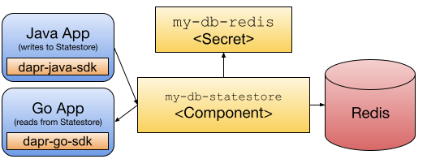

Creating platforms on top of Kubernetes is not an easy task, but some tools will make your life easier when doing so. There seems to be a trend in the Cloud-Native space where the Kubernetes API is extended to serve as the Platform interface for Development teams to request the resources they need to do their work. We have seen how this can be achieved [with tools like Crossplane in this other blog post](https://blog.crossplane.io/crossplane-and-dapr/), but this time we will look into [Kratix](kratix.io), a project born to help Platform builders build flexible platforms. 

In this blog post, we will be using Kratix to define and provision development environments that are Dapr-enabled. This enables teams working in these environments to write applications that are aware of the Dapr components (databases, message brokers, secret stores, etc.) that are available without worrying about where these components are running or how to connect to them. By using Dapr alongside Kratix we enable Platform teams not only to provision application infrastructure, but also to expose these components by using a set of APIs defined by the Dapr project.

It is essential to note that [Kratix and Crossplane play nice together](https://www.syntasso.io/post/kratix-and-crossplane), so everything discussed in my previous blog also applies to Kratix. Take a look at the Kratix Marketplace to see which tools are already integrated into Kratix: [https://kratix.io/marketplace](https://kratix.io/marketplace), as today we will be looking at the Dapr integration. 

Before jumping into the Dapr integration, there are a couple of concepts that we need to understand about Kratix.

# Composing Platforms, one block at the time

I strongly recommend checking out the Kratix docs site, which contains a great article about the value that the project brings compared to others: [https://kratix.io/docs/main/value-of-kratix](https://kratix.io/docs/main/value-of-kratix) 

In this short section, we will look into some of the Kratix core components. A goal of using Kratix is to be able to define a simple interface for our teams to consume, while at the same time enabling the Platform team(s) to have control over how different tools are installed and configured to work together. 

Because [Kratix](https://kratix.io) was designed from the ground up to help Platform teams to build platforms, it allows us to  manage multiple compute clusters and the scheduling of workloads to them . We will install Kratix into a Kubernetes Cluster – Kratix labels this cluster the ‘platform cluster’, Kratix then allows simple registration of new ‘worker’ Clusters to which teams can intelligently request their workloads. I.e A Kratix user can ask the Kratix platform to provision them a Redis cluster onto their development cluster. 


Inside Worker Clusters, teams can have their workloads and environment provisioned. This cluster management feature is fundamental to enable platform teams to scale without being restricted to a single Kubernetes Cluster and without pushing them to build from scratch all the cluster registration and workload scheduling features. 

Under the hood, Kratix leverages Gitops to handle the state of workloads on worker clusters. The complexity of the Gitops configuration and workflow management is managed declaratively by Kratix bringing the power of Gitops for free. For this example, [Flux CD]() is being used but Kratix also supports other Gitops providers such as [ArgoCD](). 


Stepping back, an empty Kratix is not much use on its own. It’s power comes when you load new capabilities into it – this is done through the concept of a **Promise**. Examples of Promises are foundational platform-building blocks such as databases or messaging technologies, or they can represent more complex customized concerns such as your organization's golden paths. Promise encapsulate 4 main features:

* A definition of the as-a-service API contract that enables the consumption of the capability. 
* A Pipeline which executes on each API request which can codify your own policies and opinions (security, compliance, etc). Pipelines are no more than a chain of containers that will run to wire things up.  
* The dependencies required to run the capability. These can be Operators, Helm charts or even [Crossplane](https://crossplane.io) compositions. 
* Scheduling hints that determine to which worker cluster each Promise is scheduled. For example, users can request Promises are sent to their own dev cluster through a label and selector pattern. Kratix also supports more complex scheduling patterns. i.e platform operators can determine that all clusters are given a certain set of Promises (security, billing, observability).  


This contract, defined by the Promise, allows us to link a Kubernetes Custom Resource Definition (as the interface for the contract) to a pipeline (or a set of pipelines) that will execute the contract every time a team creates a request. 


With Promises, we can compose complex platforms that enable teams to provision and configure complex infrastructure, applications, and services they will need to work.  


# Let’s create a Dapr-Enabled Environment

The nice thing with this approach is [Kratix provides a Dapr Promise](https://github.com/syntasso/kratix-marketplace/tree/main/dapr) that we can use out-of-the-box, for example, to create a development environment that provisions all the components that the application needs to work.

For this example, we will be creating our custom Kratix Promise that allows us to create a **Dapr StateStore Component** that connects to a Redis database – which is being provisioned using the [Kratix Redis Promise](kratix.io/marketplace) (also available in their Marketplace). 

You can follow a [step-by-step tutorial](https://github.com/salaboy/from-monolith-to-k8s/tree/main/platform/dapr-kratix) here to get this setup working in your laptop/workstation.


Our Environment CRD is quite simple, but in real life, this should contain all the parameters that development teams can tweak when creating requests to our platform. 

```
apiVersion: marketplace.kratix.io/v1alpha1
kind: env
metadata:
  name: my-dev-env
spec:
  deployApp: true
  database:   
    enabled: true
    name: "my-redis-statestore"
```

With this environment definition, we can request our platform to creates a new development environment, with the applications that we want to modify deployed and with a database provisioned specifically for these environments (in contrast with connecting to an existing database). 

For this to work, the promise definition needs to include a reference to our **Environment CRD**, to the [Dapr]() and [Redis]() Promise coming from the Marketplace, and to a Pipeline that will glue things together. 

You can check the Promise YAML file [here](https://github.com/salaboy/from-monolith-to-k8s/blob/main/platform/dapr-kratix/env-promise/promise.yaml) (as it is quite long, and there is no point in listing it here)

For this example, the pipeline is defined [here](https://github.com/salaboy/from-monolith-to-k8s/blob/main/platform/dapr-kratix/env-promise/promise.yaml#L4238). The Docker container executed can be found [here](https://github.com/salaboy/from-monolith-to-k8s/tree/main/platform/dapr-kratix/env-promise/internal/request-pipeline). It contains the configuration of the Dapr Statestore components, which need to be configured to connect to the Redis instance that the Redis Promise creates when it is requested. This is where usually all the wiring happens, as most of the time, when using projects that haven’t been designed to work together need to be adapted or connected by providing some custom glue between them. 


Once the environment is created, we can deploy applications that connect and use the Dapr Statestore by sending HTTP/GRPC requests or by using the Dapr SDK available for your programming language of choice. 

For this small example, we will deploy two applications, one that writes data to the statestore and one that reads data from the statestore. The application that writes data into the statestore is written in Java and the application that reads from the statestore is written in Go. For this small application we have used the Dapr SDKs (Java and Go), but the same behaviour can be implemented using plain HTTP or GRPC calls to the Dapr Sidecar that gets injected when we deploy these applications. 


 
You can run this example into a local Kubernetes KinD cluster by following the [step-by-step instructions located in this repository](https://github.com/salaboy/from-monolith-to-k8s/tree/main/platform/dapr-kratix/).

Adding other Dapr Components to the environments would only require to modify the Pipeline and probably reusing another Kratix Promise from the marketplace, such as the RabbitMQ Promise for supporting the Dapr Pub/Sub component. 

Do you want to help me to add that to the example? Get in touch! Drop me a message, and let’s work together on that. 

# Sum up

In this short blog post, we have enabled the platform team(s) to define an Environment Promise that application teams can request on demand. We have used two existing Kratix Promises to compose a higher-level Promise that our simple Environment resource can expose. While Kratix uses Kubernetes CRDs to create these resources, how all this is glued together is left to a Pipeline that is implemented as a container, where platform teams can use any tool that they need to wire things up together. 

By having more and more Kratix Promises in their [Marketplace](https://kratix.io/marketplace), Platform teams can easily create a platform that exposes popular tooling and then create their custom Promises for their domain-specific components and configurations.

Check the latest [Dapr 1.10 release](https://github.com/dapr/dapr/releases/tag/v1.10.0) contains many new features and improvements, such as Workflow, Pluggable Component SDKs, and Multi-App Run, read all about them in [this blog post](https://www.diagrid.io/blog/dapr-1-10-release-highlights).  Check out the [GitHub repository](https://github.com/salaboy/from-monolith-to-k8s/platform/) for more examples, and feel free to reach out if you have questions via [Twitter @Salaboy](https://twitter.com/salaboy) or my blog [https://salaboy.com](https://www.salaboy.com). You are welcome to join the [Dapr Discord](https://discord.com/invite/ptHhX6jc34) and check the [Kratix Community Page](https://kratix.io/docs/main/community) to share your experience with both Dapr and Kratix.


