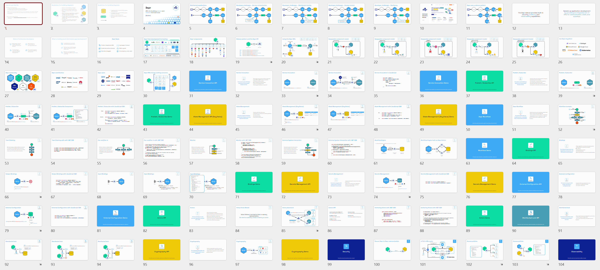
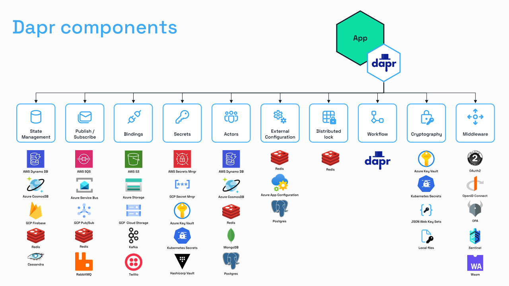
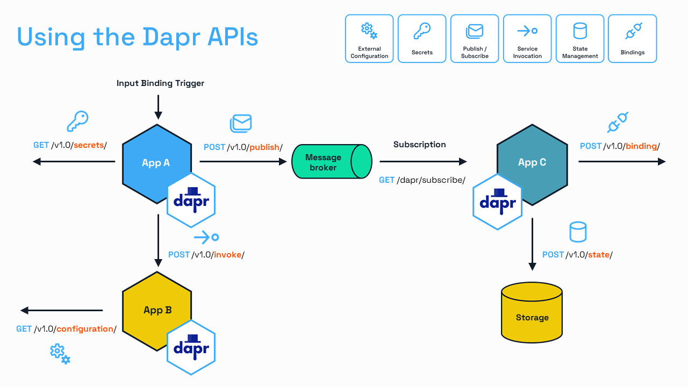
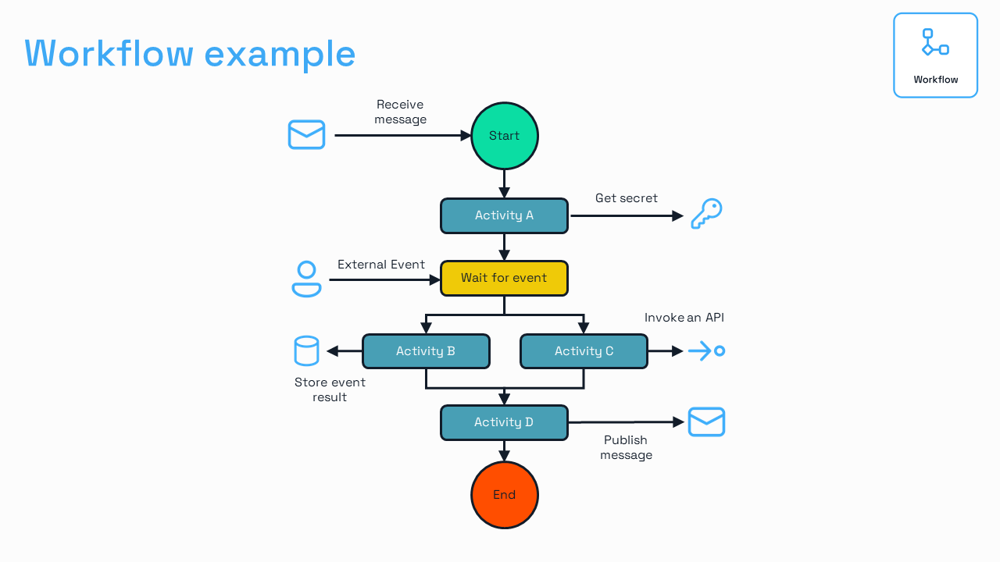
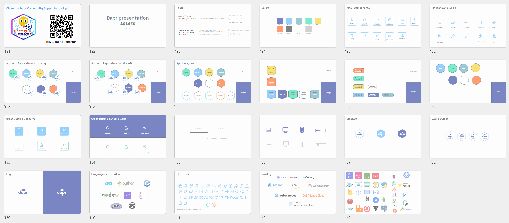

A new [Dapr slide deck](https://docs.dapr.io/contributing/presentations/) is available that you can use for your Dapr presentations!

The deck contains new icons for all Dapr APIs and built-in features such as security, resiliency, and observability. The presentation style matches the [dapr.io](http://dapr.io) website that was redesigned a while ago.

Here are some slides from the deck:

The slide deck is large (over 140 slides) and is intended to be used as a starting point for your presentation. Remove or hide what is not necessary for your audience, and add new slides to add relevance to your story.

There are instructions on the first 3 slides on building new slides and diagrams. The last 20 slides in the deck contain visual assets you can use.

The [Dapr slide deck](https://docs.dapr.io/contributing/presentations/) (PowerPoint format) is open source, so contributions are welcome!
