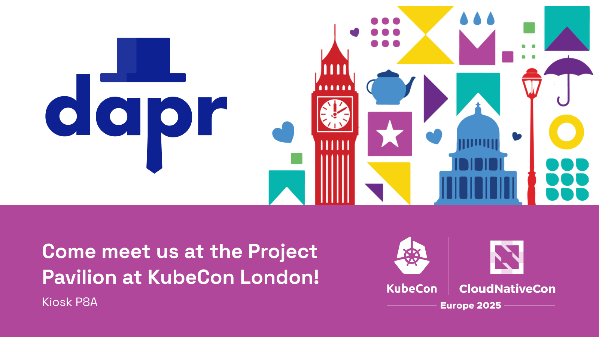
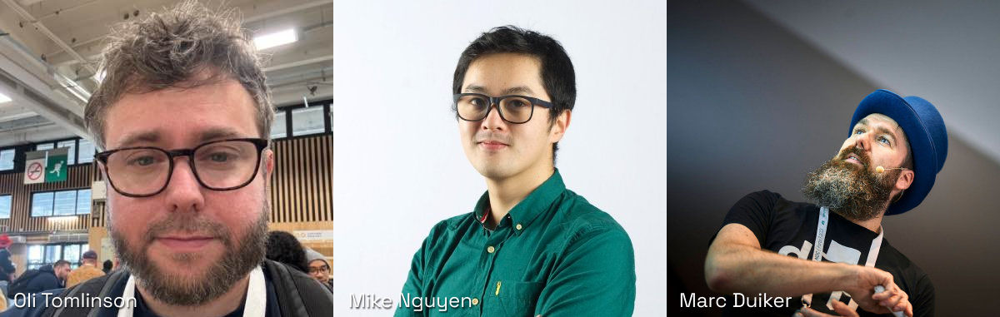
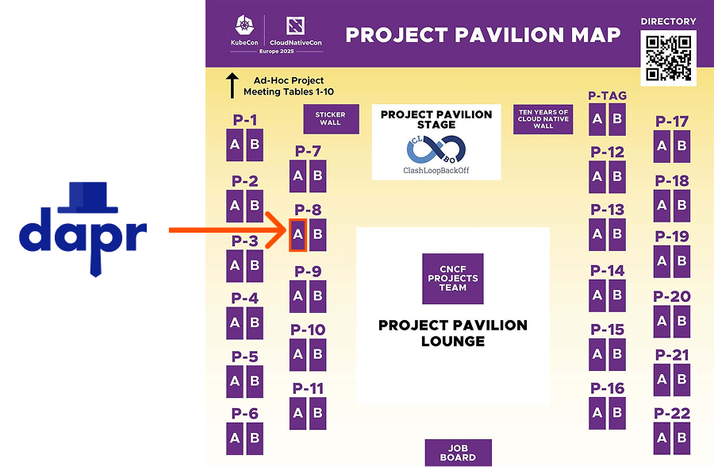

Dapr will be present at the Project Pavilion at [KubeCon Europe](https://events.linuxfoundation.org/kubecon-cloudnativecon-europe/) from Wednesday to Friday (April 2-4) during the showcase hours. Dapr is represented at the project kiosk by:

- Oli Tomlinson (Steering and Technical Committee member)
- Mike Nguyen (Maintainer)
- Marc Duiker (Community Manager)

The Dapr co-creators, Mark Fussell and Yaron Schneider, are also present at KubeCon. We can help you get in touch with them.

If you’re using Dapr, either in a POC, or in production, please come over and say hi. We love to hear your experience. If you're interested, you can also share your story during one of our [community calls](https://www.youtube.com/@daprdev/streams) or as a [CNCF case study](https://www.cncf.io/case-studies/?_sft_lf-project=dapr).

There will also be several sessions about Dapr at KubeCon and the co-located events, please join these to learn more:

**Cloud-native Rejekts**

- [Simplifying cross-cloud, cross-cluster connectivity with Dapr & Cilium with Manuel Zapf and Alice Gibbons](https://cfp.cloud-native.rejekts.io/cloud-native-rejekts-europe-london-2025/talk/DEMXNY/)

**Co-located events**

- [Streamline Your App Development With the Power of Cloud Native Tools - Julia Furst Morgado, Veeam & Mauricio Salatino, Diagrid](https://colocatedeventseu2025.sched.com/event/1u5gL/streamline-your-app-development-with-the-power-of-cloud-native-tools-julia-furst-morgado-veeam-mauricio-salatino-diagrid)
- [The Past, the Present, and the Future of Platform Engineering - Mauricio Salatino, Diagrid & Viktor Farcic, Upbound](https://colocatedeventseu2025.sched.com/event/1u5lu/the-past-the-present-and-the-future-of-platform-engineering-mauricio-salatino-diagrid-viktor-farcic-upbound)

**KubeCon**
 
- [Project Lightning Talk: Start Building Distributed Applications with Ease Using Building Block APIs - Marc Duiker, Community Manager](https://sched.co/1tcwX)
- [Dapr + Score: Mixing the Perfect Cocktail for an Enhanced Developer Experience - Mathieu Benoit, Humanitec & Kendall Roden, Diagrid](https://sched.co/1txGi)
- [Dapr in 2025: Durable Execution for AgenticAI Systems and Becoming the Backbone of App Platforms - Yaron Schneider, Diagrid & Roberto Rodriguez, CyberChasquis](https://sched.co/1tcyT)
- [Failure Is Not an Option: Durable Execution + Dapr = 🚀 - Marc Duiker, Diagrid](https://sched.co/1txBF)
- [Breaking Barriers: Bringing Application Developers Closer To the CNCF - Thomas Vitale, Systematic & Mauricio "Salaboy" Salatino, Diagrid](https://sched.co/1txEm)

You can find the Project Pavilion in Level 1 | Solutions Showcase | Hall Entrances N8 – N9. Drop by kiosk **P-8A** if you want to know more about Dapr, or want to give us feedback so we can make Dapr better for everyone!
