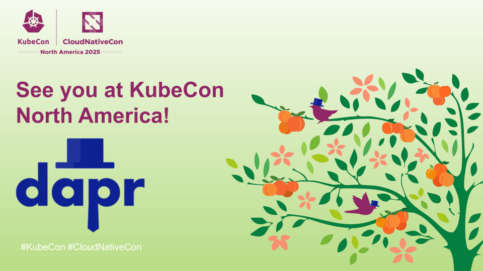
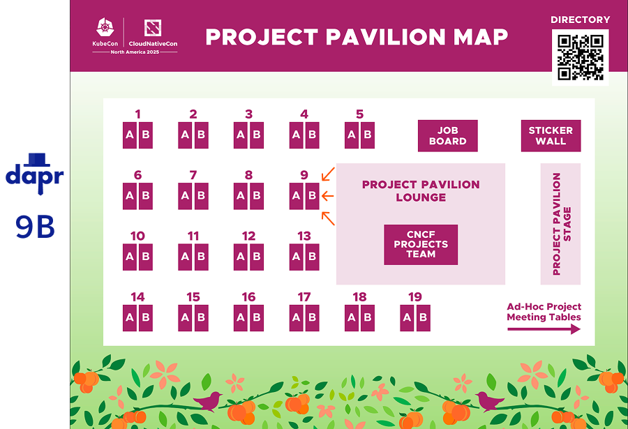

Dapr will be present at the Project Pavilion at [KubeCon North America](https://events.linuxfoundation.org/kubecon-cloudnativecon-north-america/) from Tuesday to Thursday (November 11-13) during the showcase hours. Dapr is represented at the project kiosk by:

- Whit Waldo (.NET & JavaScript SDK Maintainer)
- Marc Duiker (Community Manager & Docs Maintainer)

The Dapr co-creators, Mark Fussell and Yaron Schneider, are also present at KubeCon. We can help you get in touch with them.

If you’re using Dapr, either in a POC, or in production, please come over and say hi. We love to hear your experience. If you're interested, you can also share your story during one of our [community calls](https://www.youtube.com/@daprdev/streams) or as a [CNCF case study](https://www.cncf.io/case-studies/?_sft_lf-project=dapr).

There will also be several sessions about Dapr at KubeCon, please join these to learn more:

**Monday Nov 10th**

- [Project Lightning Talk: Dapr: Start Building Distributed Applications With Ease Using Building Block APIs](https://sched.co/27d5j) - Marc Duiker, Community Manager | 3:37pm - 3:42pm EST

**Tuesday Nov 11th**

- [The Evolution of Platform APIs in the Age of LLMs](https://sched.co/27FX3) - Mauricio "Salaboy" Salatino, Diagrid & Viktor Farcic, Upbound | 4:15pm - 4:45pm EST
- [Resilient by Design: Building Durable AI Agents on Kubernetes](https://sched.co/27FXd) - Yaron Schneider, Dapr co-creator & co-founder Diagrid |  5:00pm - 5:30pm EST
- [Simplifying Cloud Native App Testing Across Environments](https://sched.co/27FVG) - Laurent Broudoux, Postman & Artur Ciocanu, Adobe Inc | 5:45pm - 6:15pmEST

**Wednesday Nov 12th**

- [Capabilities, APIs, and Experiences: Blueprints To Build Interoperable Platforms](https://sched.co/27Faa) -  Marcos Lilljedahl, Dagger & Mauricio "Salaboy" Salatino, Diagrid | 3:00pm - 3:30pmEST

- [Dapr in 2026: Durable Execution and Resilient Eventing for AI Agents](https://sched.co/27NoL) - Yaron Schneider, Dapr co-creator & co-founder Diagrid |  5:30pm - 6:00pm EST

**Thursday Nov 13th**

- [Design Patterns for Consistent Centralized Authorization](https://sched.co/27Fek) - José Padilla, Auth0 & Alice Gibbons, Diagrid | 2:30pm - 3:00pm EST

You can find the Project Pavilion in Building B | Level 1 | Exhibit Hall B3-B5 | Solutions Showcase. Drop by kiosk **9B** if you want to know more about Dapr, or want to give us feedback so we can make Dapr better for everyone!
